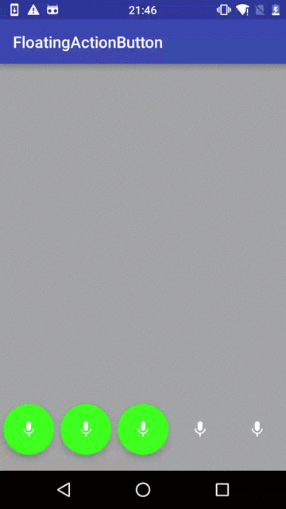

# FloatingActionButton Sample
1. A sample for use FloatingActionButton in android.support.design.widget.
2. Use ripple drawable to instead FloatingActionButton.
3. Use default touch feedback animation on ImageView.
4. Use RevealAnimator when click.

### ScreenShot

